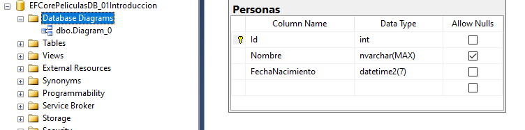

# Ejemplos de Entity Framework
Ejercicios tomados del curso de **Felipe Gavilán: Introducción a Entity Framework Core 6 - De Verdad**, y complementado con apuntes propios.

# Índice de contenidos 📋
1. [Toma de contacto](#Toma_Contacto)
2. [Introducción a Entity Framework](#Tema_01_Intro)
   1. [Configurando una aplicación de consola con EF Core y Code first](#Tema_01_Demo_Consola)       
   2. [Configurando una aplicación ASP MVC con EF Core y Code first](#Tema_01_Demo_MVC)         
2. [Modelado de base de datos](#Tema_02_Modelado_BDD)
3. [Consultando la base de datos](#Tema_03_Consultanto)
4. [Crear, modificar y borrar datos](#Tema_04_CRUD)

# Toma de contacto  🚀 <a name="Toma_Contacto"></a>

## Principales puntos 📋
* Crear BDD desde nuestro código de C# utilizando la técnica de code first.
* Leer, actualizar, borrar, y crear data utilizando Entity Framework Core.
* Relaciones entre tablas: Relaciones 1 a N, 1 a 1, y N a N.
* Utilización de [Fluent API](https://learn.microsoft.com/es-es/ef/ef6/modeling/code-first/fluent/types-and-properties) para configuraciones del esquema de BDD. Convenciones de nombres de EF.
* Utilización de datos complejos de BDD, como *"geography"*, que indica una latitud y longitud. Para su uso en .Net, se utilizará la librería [NetTopologySuite](https://github.com/NetTopologySuite/NetTopologySuite)
* Utilización de pruebas automáticas en proyectos de Entity Framework Core.
* Utilización de funciones como Sum, Average y GroupBy.
* Utilización de procedimientos almacenados utilizando Entity Framework Core.
* Carga de datos y diferencias de: eager, explicit, select y lazy loading.
* Utilización de ejecución diferida para hacer nuestro código más flexible y reutilizable.
* Uso correcto de EF, como debemos usar un pool para reciclar el DbContext.

## Pre-requisitos 📋
Como herramientas de desarrollo necesitarás:
* Visual Studio 2022 (con la versión para .NET 6)
* SQL Server (con la versión Express es suficiente)
* Tener instalado el [Command-line interface (CLI) de EF](https://learn.microsoft.com/en-us/ef/core/cli/dotnet). Ejecutar en un cmd:
```
dotnet tool install --global dotnet-ef
```

## Antes de comenzar... entiende la base de datos que vamos a utilizar ⚙️
Los ejemplos se realizan sobre una base de datos de cines, con las salas que tiene cada cine, qué películas emiten, etcétera. A medida que avanza el curso, se va añadiendo complejidad.

Las tablas maestras (que pueden variar en función de los ejercicios), son las siguientes:
* Tabla **[Cines]**: datos maestros de cines.
* Tabla **[Generos]**: datos maestros de géneros de películas (Acción, Animación, Comedia, Ciencia ficción, Drama, etc).
* Tabla **[Pelicula]**: datos maestros de películas.
* Tabla **[Actores]**: datos maestros de actores de rodaje.

Las tablas intermedias, son las siguientes:
* Tabla **[CinesOfertas]**: ofertas que tiene un cine. Relación 1 a 1.
* Tabla **[SalasDeCine]**: salas de un cine (estándarm 3D, premium, etc). 1 cine tiene N salas.
* Tabla **[PeliculaSalaDeCine]**: en qué salas se emite una película. Relación N a N entre **[SalasDeCine]** y **[Peliculas]**.
* Tabla **[GeneroPelicula]**: géneros en los que clasificar las películas. Relación N a N entre **[Generos]** y **[Peliculas]**.
* Tabla **[PeliculasActores]**: películas en los que participan los actores. Relación N a N entre **[Actores]** y **[Peliculas]**.

## Esquema de base de datos <a name="Esquema_BDD"></a>⚙️


## Construido con 🛠️
* [Microsoft Visual Studio Profesional 2022](https://visualstudio.microsoft.com/es/vs/) - IDE  de desarrollo
* [SQL Server Management Studio](https://docs.microsoft.com/es-es/sql/?view=sql-server-ver15/) - IDE de base de datos

## Autores ✒️
* **Felipe Gavilán** - *Trabajo Inicial* - [gavilanch](https://github.com/gavilanch/Entity-Framework-Core-De-Verdad.git)
* **David Santesteban** - *Trabajos con apuntes propios* - [davidsantes](https://github.com/davidsantes)

## Agradecimientos 🎁

* Plataforma de aprendizaje online [Udemy](https://www.udemy.com/course/introduccion-a-entity-framework-core-2-1-de-verdad/)
* A cualquiera que me invite a una cerveza 🍺.

---

# MÓDULO 01. Introducción a Entity Framework <a name="Tema_01_Intro"></a>
**Objetivo:** creación y configuración de una base de datos.
**Principales características:**
* Code First: a partir de C#, se crea la BDD.
* Database First: ya existe la BDD.

## 1.1 Configurando una aplicación de consola con EF Core y Code first <a name="Tema_01_Demo_Consola"></a>

### Objetivo 🚀
* Crear migraciones para crear la Base de datos en base a una clase **[Persona]**, que a través de un DBSet, creará su correspondiente tabla en la BDD.

### Principales puntos técnicos 📋
* Instalar el paquete Nuget **Microsoft.EntityFrameworkCore.SqlServer**, necesario para utilizar EF.
* Instalar el paquete Nuget **Microsoft.EntityFrameworkCore.Tools**, necesario para ejecutar comandos de EF desde el Package Manager Console.
* Utilización de un DBContext: **ApplicationDbContext.cs**.
* Omitir los warnings que aparecen debido al error [CS8618 - Non-nullable variable must contain a non-null value when exiting constructor. Consider declaring it as nullable](https://learn.microsoft.com/en-us/dotnet/csharp/language-reference/compiler-messages/nullable-warnings). Pondremos la propiedad del proyecto ```<Nullable>disable</Nullable>```
* Base de datos utilizada: **[EFCorePeliculasDB_01Introduccion]**

### Comenzando 🚀

* Omitir los warnings que aparecen debido al error [CS8618 - Non-nullable variable must contain a non-null value when exiting constructor. Consider declaring it as nullable](https://learn.microsoft.com/en-us/dotnet/csharp/language-reference/compiler-messages/nullable-warnings). Pondremos la propiedad del proyecto ```<Nullable>disable</Nullable>```
* Base de datos utilizada: **[EFCorePeliculasDB_01Introduccion]**

### Migraciones ⚙️
* ```Add-Migration 01_Inicial```: Código necesario para la migración con la entidad **[Personas]**
* ```Update-Database```: ejecución de la migración y creación de la BDD **[EFCorePeliculasDB_01Introduccion]**.

### ¿Cómo queda la base de datos? 🔩

---

## 1.2 Configurando una aplicación ASP MVC con EF Core y Code first <a name="Tema_01_Demo_MVC"></a>
Toma de contacto con EF y una aplicación ASP MVC.

### Objetivo 🚀
* Crear migraciones para crear la Base de datos en base a una clase **[Persona]**, que a través de un DBSet, creará su correspondiente tabla en la BDD.

### Principales puntos técnicos 📋
* Instalar el paquete Nuget **Microsoft.EntityFrameworkCore.SqlServer**, necesario para utilizar EF.
* Instalar el paquete Nuget **Microsoft.EntityFrameworkCore.Tools**, necesario para ejecutar comandos de EF desde el Package Manager Console.
* Utilización de un DBContext: **ApplicationDbContext.cs**.
* Omitir los warnings que aparecen debido al error [CS8618 - Non-nullable variable must contain a non-null value when exiting constructor. Consider declaring it as nullable](https://learn.microsoft.com/en-us/dotnet/csharp/language-reference/compiler-messages/nullable-warnings). Pondremos la propiedad del proyecto ```<Nullable>disable</Nullable>```
* Base de datos utilizada: **[EFCorePeliculasDB_01Introduccion_MVC]**

### Comenzando 🚀
* Omitir los warnings que aparecen debido al error [CS8618 - Non-nullable variable must contain a non-null value when exiting constructor. Consider declaring it as nullable](https://learn.microsoft.com/en-us/dotnet/csharp/language-reference/compiler-messages/nullable-warnings). Pondremos la propiedad del proyecto ```<Nullable>disable</Nullable>```
* Usar **appsettings.Development.json** para almacenar el connectionstring DbContextOptions
* Base de datos utilizada: **[EFCorePeliculasDB_01Introduccion_MVC]**

### Migraciones ⚙️
* ```Add-Migration 01_Inicial```: Código necesario para la migración con la entidad **[Personas]**
* ```Update-Database```: ejecución de la migración y creación de la BDD **[EFCorePeliculasDB_01Introduccion]**.

### ¿Cómo queda la base de datos? 🔩

---

# MÓDULO 02. Modelado de base de datos <a name="Tema_02_Modelado_BDD"></a>
**Objetivo:** creación y configuración de una base de datos a través de Code First y migraciones. Exceptuando las migraciones, el resto vale para Database first).
**Principales características:**
* Creación de la BDD de la que se basará el resto de ejemplos a través de entidades cine, película, actor, etc, de c# (code first).
* Creación de llaves primarias, tanto por convención como por configuración.
* Campos de texto: longitud máxima de los campos, que no sean nulos y tipo de dato de la columna.
* Campos espaciales (longitud, latitud): utilización de la librería [**NetApologySuite**](https://github.com/NetTopologySuite/NetTopologySuite).
* Campos Unicode para reducir el tamaño de dicho campo y que no acepte caracteres extraños en una URL (```varchar``` vs ```nvarchar```).
* Configuración de relaciones 1 a 1, 1 a N, N a N.
* Configuración de relaciones N a N de manera automática (renunciando al control de la clase intermedia) o manual (debemos configurar completamente la tabla intermedia, aunque es recomendable).
* Hacer configuraciones por convenciones automáticas de EF:
  * Por atributo en la entidad (```Key, StringLength, MaxLength, Required, etc```)
  * Por Fluent API del ```DBContext``` (método ```OnModelCreating```).
  * Configurando convenciones reutilizables: por ejemplo, si queremos que un ```DateTime``` de c# se mapee siempre a ```date``` de SQL.
* Utilización de **IEntityTypeConfiguration** para separar en clases las configuraciones de Fluent API.
---

## 2.0 Migraciones ⚙️ <a name="Tema_02_Modelado_Migraciones"></a>
* Ejecutar la siquiente sentencia en el **Package Manager Console** (cuidado con el proyecto de inicio en la consola), la cual ejecutará todas las migraciones:
  * ```Update-Database```
* Realizará las siguientes migraciones:  
  * Creación de la BDD **[EFCorePeliculasDB_02_Modelado_BDD]**.

### 2.0.1 ¿Cómo queda la base de datos? <a name="Tema_02_Modelado_Esquema"></a> 🔩
* Similar al esquema [Esquema de base de datos](#Esquema_BDD)

## 2.1 Creando el proyecto <a name="Tema_02_Modelado_Creacion"></a>
* Proyecto utilizado: ver carpeta virtual de la solución **02_Modelado_Bdd**
* BDD utilizada: **[EFCorePeliculasDB_02_Modelado_BDD]**

## 2.2 Llaves primarias <a name="Tema_02_Modelado_Llaves_Primarias"></a>
* **Con convención de EF**: si un campo se llama "Id" o "NombreTablaId" automáticamente se configura como una llave primaria
* **Sin convención de EF**: para determinar que un campo [identificador] es una llave primaria, se puede hacer con atributos ```[Key]``` o mediante Fluent API del ```ApplicationDbContext``` (método ```OnModelCreating```)

## 2.3 Longitud máxima de campos <a name="Tema_02_Modelado_Longitud_Campos"></a>
* Longitud máxima:
  * **StringLength y MaxLength**: revisar la clase Genero.cs.
  * **A través de Fluent API**: revisar ```ApplicationDbContext``` (método ```OnModelCreating```)
* Campos no nulos:
  * **Required**: revisar la clase Genero.cs.
  * **A través de Fluent API**: revisar ```ApplicationDbContext``` (método ```OnModelCreating```) 

## 2.4 Cambiando nombres y esquema de tablas y columnas <a name="Tema_02_Modelado_Nombres_Esquema"></a>
* Si no quiero que la tabla o columnas, utilicen el mismo nombre que la entidad, o si quiero añadir (opcionalmente), el esquema:
  * **Tablas**: revisar código comentado en Genero.cs ```[Table("TablaGeneros", Schema = "peliculas")]```.
  * **Columnas**:  revisar código comentado en Genero.cs ```[Column("NombreGenero")]```.
  * **A través de Fluent API**: revisar ```ApplicationDbContext``` (método ```OnModelCreating```) y ```GeneroConfig.cs```. El código está comentado.

## 2.5 Creando la entidad Actor: Mapeo de DateTime a Date <a name="Tema_02_Modelado_MapeoDateTimeDate"></a>
* Campo Actor.cs **FechaNacimiento**, de tipo fecha:
  * Por defecto, un campo ```DateTime``` se va a mapear en BDD con un tipo ```datetime2``` (con hora, minutos...) y no va a ser null.
  * Mapear a tipo ```Date``` en vez de ```datetime2```:
    * Modo 1: Poner en el campo el atributo [Column(TypeName = "Date")]
    * Modo 2: A través de Fluent API, revisar ```ApplicationDbContext``` (método ```OnModelCreating```) y ```ActorConfig.cs```. El código está comentado.
  * Mapear a nullable: ```DateTime? FechaNacimiento```.

## 2.6 Otras propiedades interesantes <a name="Tema_02_Modelado_OtrasPropiedades"></a>
* **Uso de Enums**: campo de tipo enum, en SalaDeCine.cs, de tipo ```TipoSalaDeCine``` (enum).
  * Creará un campo de tipo numérico.
* **Valores por defecto**:
  * Para configurar valores por defecto, utilizaremos en la configuración **HasDefaultValue** (un valor por defecto de C#) o **HasDefaultValueSql** (para utilizar funciones de sql como ```getdate()```).

## 2.7 Creando entidades <a name="Tema_02_Modelado_CreandoEntidades"></a>
* Clase ```Cine```, características destacables:
  * Ubicación geográfica, que se guardará en BDD en un campo de tipo ```geography```. Para ello, se utilizará la librería [NetTopologySuite](https://github.com/NetTopologySuite/NetTopologySuite) y el tipo ```Point```.
  * Para usar [NetTopologySuite](https://github.com/NetTopologySuite/NetTopologySuite) en el program.cs, cuando se crea ```builder.Services.AddDbContext```, hay que informarlo.
* Clase ```SalaDeCine```, características destacables:
  * La propiedad **Precio** es decimal. Por defecto creará en la base de datos un ```decimal(18,2)```. Para limitar las precisiones a 9 y 2 comas flotantes, y que ocupe casi la mitad de bytes:
    * Modo 1: Revisar SalaDeCine.cs ```[Precision(precision: 9, scale: 2)]```
    * Modo 2: A través de Fluent API (revisar la clase ```SalaDeCineConfig.cs```)
* Clase ```Pelicula```, características destacables:
  * La propiedad **Url** solo aceptará **Unicode** (```varchar```), por lo que no aceptará caracteres extraños (```nvarchar```). Para hacerlo:
    * Modo 1: Revisar Pelicula.cs ```[Unicode(false)]```
    * Modo 2: A través de Fluent API (revisar la clase ```PeliculaConfig.cs```)   

## 2.8 Creando relaciones <a name="Tema_02_Modelado_CreandoRelaciones"></a> 
* **Relación 1 a 1**:
  * Oferta de un cine:
    * 1 Cine tiene 1 oferta.
    * Para enlazar:
      * Clase ```Cine```: tendrá como propiedad a ```CineOferta```.
      * Clase ```CineOferta```: tendrá como propiedad el cine ```CineId```.      
* **Relación 1 a N**:
  * Cine con sus salas de cine (2D, 3D, etc):
    * 1 Cine tiene N salas con precios diferentes.
    * Para enlazar:
      * Clase ```Cine```: tendrá una lista de ```SalaDeCine```. En este caso, es ```HashSet``` (no ordena aunque es más rápido). Si se quiere, podría ser ```ICollection```, ```List```, etc.
      * Clase ```CineOferta```: tendrá como propiedad a ```Cine```.      
* **Relación N a N**:
  * 1 película puede tener N géneros, y 1 género puede tener N películas.
  * 1 película puede emitirse en N salas de cine, y 1 sala de cine puede emitir N películas.
  * 1 actor puede participar en N películas, y 1 película pueden participar N actores.
  * Para enlazar, modos de generación:
    * **De manera automática (No recomendado)**: se renuncia al control directo de la tabla intermedia, ya que no existe entidad que lo maneje.
      * Clase ```Pelicula``` una lista de ```Generos```. Se ha puesto como HashSet.
      * Clase ```Genero``` una lista de ```Peliculas```. Se ha puesto como HashSet.
      * Clase ```Pelicula``` una lista de ```SalaDeCine```. Se ha puesto como HashSet.
      * Clase ```SalaDeCine``` una lista de ```Peliculas```. Se ha puesto como HashSet.      
    * **De manera manual (Sí recomendado)**: si se quiere introducir información extra en la tabla intermedia que relacione película y actores, como el nombre del personaje y el nombre de los actores, o en qué orden se mostrarán los actores en una película.
      * Clase ```PeliculaActor``` es la entidad intermedia, donde estarán: 
        * Las propiedades de unión ```PeliculaId``` y ```ActorId```.
        * Las propiedades de navegación ```Pelicula``` y ```Actor```.
      * Clase ```Pelicula```, una lista de ```PeliculaActor```.
      * Clase ```Actor```, una lista de ```PeliculaActor```.
      * Se deberá configurar la llave primaria compuesta:
        * Mediante Fluent API: ```builder.HasKey(prop => new { prop.PeliculaId, prop.ActorId });```

## 2.9 Configurando convenciones reutilizables <a name="Tema_02_Modelado_ConfigurandoConvenciones"></a> 
* Por ejemplo, EF mapea un string a un nvarchar(max). Esto no quiere decir que no se pueda tener dicho caso, sino que no va a ser el comportamiento por defecto.
* De esta manera se puede ahorrar mucho código repetido.
* Existe un ejemplo en ```ApplicationDbContext```, método ```ConfigureConventions```, para que los métodos ```DateTime``` sean mapeados a ```Date```.
* Si se quiere que algún método ```DateTime``` se convierta a otro tipo, habrá que hacerlo explícitamente. Existe un ejemplo comentado en ```ActorConfig```.

## 2.10 Organizando OnModelCreating para organizar el código <a name="Tema_02_Modelado_OrganizandoOnModelCreating"></a> 
* Se pueden crear clases más pequeñas para organizar el Fluent API. Revisar ```OnModelCreating```.
* Se podrán registrar las clases 1 a 1 o todo el ensamblado a la vez.

---

# MÓDULO 03. Consultando datos <a name="Tema_03_Consultanto"></a>
**Objetivo:** creación de métodos de consulta
**Principales características:**
* Inserción de datos con Data Seeding.
* Queries más rápidas con ```AsNoTracking```.
* Obtener el primer registro con ```First``` y ```FirstOrDefault```.
* Filtros con ```Where```.
* Ordenación con ```OrderBy``` y ```OrderByDescending```.
* Paginando con ```Skip``` y ```Take```.
* Seleccionar columnas con ```Select``` o con Automapper.
* Consulta de datos Espaciales (longitud, latitud).
* Automapper: ```ProjectTo```.
* Agrupar con ```GroupBy```. 
* Eager Loading - ```Include``` y ```ThenInclude```: cargando datos relacionados.
* Select Loading - Cargado selectivo.
* Explicit loading - Carga Explícita.
* Lazy Loading - Carga perezosa.
* Ejecución diferida (AsQueryAble): Filtros dinámicos.
---

## 3.0 Migraciones ⚙️ <a name="Tema_03_Consultanto_Migraciones"></a>
* Ejecutar la siquiente sentencia en el **Package Manager Console** (cuidado con el proyecto de inicio en la consola), la cual ejecutará todas las migraciones:
  * ```Update-Database```
* Realizará las siguientes migraciones:  
  * Creación de la BDD **[EFCorePeliculasDB_03_Consulta_BDD]**.
  * Creación del esquema.
  * Inserción de datos de prueba.

### 3.0.1 ¿Cómo queda la base de datos? 🔩
* Similar al esquema [Esquema de base de datos](#Esquema_BDD)
 
## 3.1 Creando el proyecto <a name="Tema_03_Consultanto_Creacion"></a>
* Proyecto utilizado: ver carpeta virtual de la solución **03_Consultando_Datos**
* BDD utilizada: **[EFCorePeliculasDB_03_Consulta_BDD]**

## 3.2 Inserción de datos con Data Seeding <a name="Tema_03_Consultanto_DataSeeding"></a> 
* Se puede realizar una carga de datos inicial a través del Data Seeding.
* Revisar el método ```OnModelCreating``` de la clase ```ApplicationDbContext```.
* Se llama a la clase ```SeedingModuloConsulta```, donde se insertan los datos de la base de datos.
* Al añadir la migración ```DatosDePrueba``` añade todos esos datos.

## 3.3 Queries más rápidas con ```AsNoTracking``` <a name="Tema_03_Consultanto_AsNoTracking"></a> 
* Si no se tiene interés en manejar el estado de una entidad (updated, etc), se puede utilizar ```AsNoTracking```.
* Se utiliza para cuando el fin es lectura pero no actualización de los datos.
* **Ventaja:** son más rápidos que los queries normales.
* Se puede hacer la configuración de AsNoTracking:
  * De manera individual: revisar ```GenerosController```, código comentado en método ```Get()```.
  * De manera global: 
    * Revisar ```program```, código ```UseQueryTrackingBehavior``` a la hora de configurar el DbContext.
    * Si se quiere activar el seguimiento de un método, se puede utilizar ```.AsTracking()```. revisar ```GenerosController```, código comentado en método ```Get()```.

## 3.4 Obtener el primer registro con ```First``` y ```FirstOrDefault``` <a name="Tema_03_Consultanto_First"></a> 
* Revisar ```GenerosController```, código en método ```GetPrimerGeneroConNombreEmpiezaConLetraC()```.

## 3.5 Obtener elementos filtrados con ```Where```<a name="Tema_03_Consultanto_Where"></a> 
* Revisar ```GenerosController```, código en método ```GetFiltroPorNombre()```.
* Se puede filtrar por más de un elemento, por ejemplo, que empiece por una letra y otra. Revisar ```GenerosController```, código comentado en método ```GetFiltroPorNombre()```.

## 3.6 Ordenación con ```OrderBy``` y ```OrderByDescending```<a name="Tema_03_Consultanto_Order"></a> 
* Revisar ```GenerosController```, código en método ```Get()```.

## 3.7 Paginando con ```Skip``` y ```Take```<a name="Tema_03_Consultanto_Paginacion"></a> 
* Para no traer todos los registros de la base de datos.
* Para ello, se utiliza Take y Skip.
* Revisar ```GenerosController```, código en método ```GetPaginacion()```.

## 3.8 Seleccionar columnas con ```Select```<a name="Tema_03_Consultanto_Select"></a> 
* Para no traer todos los campos de una entidad.
* Revisar ```AutoresController```, código en método ```GetConSelectAnonimo()``` y ```GetConSelectADto```.
* Esto genera una SQL (se puede ver en la consola.exe de VS) que retorna solo los datos solicitados.

## 3.9 Seleccionar columnas con ```Select``` o con Automapper<a name="Tema_03_Consultanto_Select"></a> 
* Para no traer todos los campos de una entidad.
* Revisar ```AutoresController```, código en método ```GetConSelectAnonimo()``` y ```GetConSelectADto```.
* Esto genera una SQL (se puede ver en la consola.exe de VS) que retorna solo los datos solicitados.
* También se puede ahorrar el Select utilizando Automapper. 
  * Revisar ```AutoresController```, código en método ```GetAutomapper()```. Revi
  * Revisar la clase ```AutoMapperProfiles```.

## 3.10 Consulta de datos Espaciales - Point (longitud, latitud)<a name="Tema_03_Consultanto_Point"></a> 
* Para datos complejos como latitud / longitud, se puede utilizar **NetTopologySuite**. Se puede filtrar, o indicar los cines o puntos más cercanos.
* Revisar:
  * ```CinesController```, código en método ```GetCinesCercanosConNetTopologySuite()```.
  * Revisar la clase ```AutoMapperProfiles```, donde se hacen transformaciones de longitud y latitud.

## 3.11 Agrupar con ```GroupBy```<a name="Tema_03_Consultanto_GroupBy"></a> 
* Revisar ```PeliculasController```, código en método ```GetAgrupadasPorCantidadDeGeneros()```.

## 3.12 Eager Loading - ```Include``` y ```ThenInclude```: cargando datos relacionados <a name="Tema_03_Consultanto_Eager"></a> 
* **Eager loading:** en la query se indica explícitamente los datos a cargar. Hay que utilizar include para los hijos a retornar.
* Revisar en **PeliculasController**, método ```GetEagerLoading```:
  * **Include**: permite cargar el hijo.
  * **ThenInclude**: permite entrar en el hijo del hijo del hijo. Por ejemplo, en una película, que cargue la tabla intermedia peliculas actores, y a su vez los actores. 
  * **IgnoreCycles**: para evitar redundancia cíclica (una clase película tiene actores, pero los actores tienen películas), se utiliza IgnoreCycles en program.cs  
  * También se ordenan los hijos y se filtran por valores específicos (por ejemplo, que la fecha de nacimiento de los actores sea >= 1980)

## 3.13 Select Loading - Cargado selectivo <a name="Tema_03_Consultanto_Select"></a> 
* **Select loading:** para devolver clases anónimas con solo los datos que me interesan.
  * Por ejemplo, nombre película y número de cines que la emiten. 
  * Es una opción a tener en cuenta para queries complicadas.
* En anteriores ejemplos se ha hecho un select simple, pero se pueden cargar entidades relacionadas.
* Revisar en **PeliculasController**, método ```GetSelectLoading```:
  * Además de devolver una clase anónima, devuelve datos interesantes como el número de coincidencias total.

## 3.14 Explicit loading - Carga explícita <a name="Tema_03_Consultanto_Explicit"></a> 
* **Explicit loading:** útil para hacer filtros en los hijos del padre, u operaciones secundarias con los hijos.
  * Se carga en diferentes líneas de código.
  * Es necesario utilizar AsTracking().
  * No es tan eficiente como hacer 1 query, ya que obliga a volver a cargar la entidad principal. 
  * Es más recomendado hacer eager o select loading.
* Revisar en **PeliculasController**, método ```GetExplicitLoading```.

## 3.15 Lazy loading - Carga perezosa <a name="Tema_03_Consultanto_Lazy"></a> 
* **Lazy loading:** (no recomendado y no existe método de ejemplo en el código):
  * Si alguien intenta acceder a datos de hijos, los intentará cargar. Si los datos hijos no han sido cargados, los carga de las bdd. Si ya está cargado en memoria, utiliza esa. Un ejemplo algo oculto es Automapper, que intentará analizar todas las propiedades.
  * Ineficiente. Hay que hacer varias queries separadas. También nos exponemos a peligros como el problema N+1, una query por cada entidad (por ejemplo, si hay foreach).
  * Se recomienda utilizar antes, eager loading, select loading, y en último caso caso, explicit loading.
  * Hay que instalar **Microsoft.EntityFrameworkCore.Proxies**.
  * Hay que configurar el dbContext para usar ```UseLazyLoadingProxies```, normalmente en el ```program.cs```.
  * Todas las entidades del modelo hijas, deben ser virtual (virtual HashSet, virtual CineOferta, virtual List, etc)
  * Las consultas utilizan ```AsTracking()```

## 3.16 Ejecución diferida (AsQueryAble): Filtros dinámicos <a name="Tema_03_Consultanto_Diferida"></a> 
* Se utiliza para componer la query en función de si se pasan los parámetros o no.
* Se debe utilizar ```AsQueryAble()```, el cual nos permite ir construyendo la query.
* Revisar en **PeliculasController**, método ```GetFiltrarDinamicoEjecucionDiferida```. 

---

# MÓDULO 04. Crear, modificar y borrar datos <a name="Tema_04_CRUD"></a>
**Objetivo:** manejo de datos, creación, modificación y eliminación de los datos.
**Principales características:**
* Modelo Conectado y Modelo Desconectado - Estatus
* Insertando Registros
* Insertando Varios Registros
* Insertar Registros con Data Relacionada Nueva
* DTO para Insertar Cine (opcional)
* Insertar Registros con Data Relacionada Existente
* Mapeo Flexible
* Actualizando Registros - Modelo Conectado
* Actualizando Registros - Modelo Desconectado
* Borrado Normal
* Borrado Suave o Lógico
* Filtros al Nivel del Modelo 
---

## 4.0 Migraciones ⚙️ <a name="Tema_04_Crud_Migraciones"></a>
* Ejecutar la siquiente sentencia en el **Package Manager Console** (cuidado con el proyecto de inicio en la consola), la cual ejecutará todas las migraciones:
  * ```Update-Database```
* Realizará las siguientes migraciones:  
  * Creación de la BDD **[EFCorePeliculasDB_04_CRUD_BDD]**.
  * Creación del esquema.
  * Inserción de datos de prueba.

### 4.0.1 ¿Cómo queda la base de datos? 🔩
* Similar al esquema [Esquema de base de datos](#Esquema_BDD)
 
## 4.1 Creando el proyecto <a name="Tema_04_Crud_Creacion"></a>
* Proyecto utilizado: ver carpeta virtual de la solución **04_Crear_Actualizar_Borrar**
* BDD utilizada: **[EFCorePeliculasDB_04_CRUD_BDD]**
